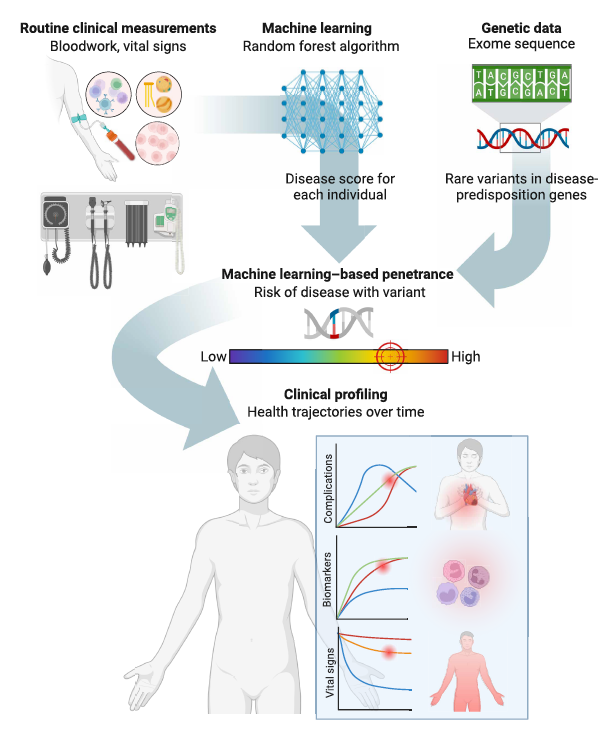
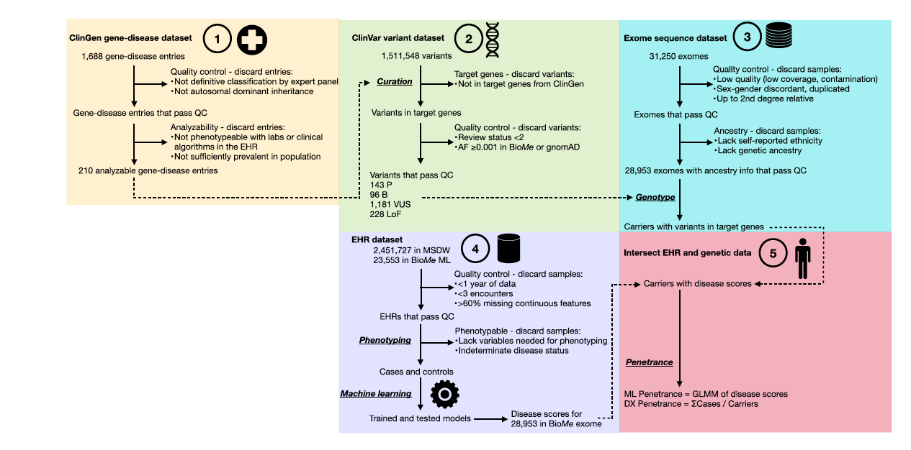

::: {style="font-size: 75%;"}

## Limitations in current methods of variant interpretation 

- Traditional [penetrance]{title="Penetrance is the probability that a person with a specific variant will develop the disease"} estimates rely on small, disease-enriched cohorts → [**ascertainment bias**](https://catalogofbias.org/biases/ascertainment-bias){title="A distortion in data, as presented or analysed, that have been collected in such a way that some members of the target population are more or less likely to be included in the final results than others, creating a difference between the study population and the target population"}

- Patients are classified in a **binary** manner - case/control, sick/healthy, etc. while ignoring the fact that diseases exist on a spectrum
- Studies with smaller scope cannot assess **rare variants** with significant accuracy
- Difficult to interpret if [**Variants of Uncertain Signifance (VUS)**](https://www.genome.gov/genetics-glossary/Variant-of-Uncertain-Significance-VUS){title="When analysis of a patient’s genome identifies a variant, but it is unclear whether that variant is actually connected to a health condition, the finding is called a variant of uncertain significance. In many cases, these variants are so rare in the population that little information is available about them"} are associated with disease pathogenecity or are harmful
:::

---

## Research Question {.center}
::: {style="font-size: 75%;"}

::: {.center}
Given a genetic variant exists in a patient, can machine learning and statistical methods predict what is its penetrance?
:::
:::

---

## Methodology
::: {style="font-size: 75%;"}

::: {.center}
- Development, testing, and application of disease-predictive ML models to generate **disease scores**

- Identification of individuals carrying rare P variants in genes corresponding to 10 dominant genetic conditions

:::: columns
::: {.center}
::: {.column width="50%"}
::: {style="font-size: 80%;"}
1. Arrhythmogenic Right Ventricular Cardiomyopathy (ARVC)
2. Familial Breast Cancer (FBC)
3. Familial Hypercholesterolemia (FH)
4. Hypertrophic Cardiomyopathy (HCM)
5. Adult Hypophosphatasia (HPP)
:::
:::
::: {.column width="50%"}
::: {style="font-size: 80%;"}
6. Long QT Syndrome (LQTS)
7. Lynch Syndrome (LS)
8. Monogenic Diabetes (MD)
9. Polycystic Kidney Disease (PKD)
10. von Willebrand Disease (VWD)
:::
:::
:::
::::

- Computation and characterization of ML penetrance
:::
:::

## Methodology
::: {style="font-size: 75%;"}

:::: {.columns}

::: {.column width="35%"}
The disease scores can be used as a continuous measure of measuring odds of disease. 

Instead of 

::: {.fragment .highlight-red}
::: {.fragment .strike}
**"you have the variant, you might get sick"**
:::
:::

the model will allow us to predict 

::: {.fragment .highlight-green}
**"you have this variant, based on the data, you risk for disease is x%"**
:::
:::
:::

::: {.column width="35%"}
{.absolute .fragment bottom="10" right="10" width="650"}
:::

::::

## Data

::: {style="font-size: 75%;"}
| Cohort | N Participants | Purpose | Median Age |
|--------|---------------|---------|--------------|
| [**MSDW**](https://researchroadmap.mssm.edu/reference/systems/msdw/){title="Mount Sinai Data Warehouse"} | 1,325,257 | Model training & validation | 55 years |
| [**BioMe ML**](https://icahn.mssm.edu/research/ipm/programs/biome-biobank/pioneering){title="BioMe is an electronic medical record-linked biobank that enables researchers to quickly and efficiently conduct genetic, epidemiologic, molecular, and genomic studies on large collections of research specimens linked with medical information"} | 22,041 | Model testing (holdout) | 56 years |
| [**BioMe Exome**](https://icahn.mssm.edu/research/ipm/programs/biome-biobank/pioneering){title="BioMe is an electronic medical record-linked biobank that enables researchers to quickly and efficiently conduct genetic, epidemiologic, molecular, and genomic studies on large collections of research specimens linked with medical information"} | 28,953 | Penetrance assessment | 65 years |
:::

## Workflow
{.absolute width="150%"}

## Prediction Model Features
::: {style="font-size: 75%;"}

**Input Features** (47 lab tests + 9 vital signs)

- Routine laboratory measurements (median values)

- Complete blood count, metabolic panel

- Lipid profiles, liver/kidney function

- Vital signs (BP, heart rate, BMI)

- Demographics (age, sex, ancestry)
:::

## Predictive Performance of ML Models

::: {style="font-size: 75%;"}

| Metric | MSDW (Internal) | BioMe (Holdout) |
|--------|-----------------|-----------------|
| **Mean AUROC** | 0.85 (0.77-0.95) | 0.84 (0.79-0.95) |
| **Sensitivity** | 0.77 (0.70-0.87) | 0.78 (0.74-0.88) |
| **Specificity** | 0.78 (0.68-0.91) | 0.78 (0.67-0.92) |

**Example**: 

- FH model identified LDL-C, total cholesterol, age, and HDL-C as most important features

- Glucose, age, body mass index (BMI), and glomerular filtration rate (GFR) were the most important features for the MD models
:::

## ML Penetrance Evaluation

::: {style="font-size: 75%;"}

- Apply ML models to generate **continuous disease probability scores** (0-1)
- Use **Generalized Linear Mixed-Effects Model (GLMM)** to compute penetrance
- Accounts for variability between carriers and across ML iterations
    - logit-transformed disease scores from all 50 ML iterations in all carriers, which accounted for variability in scores between different carriers (random effects term) and variability in scores between different ML iterations within the same individual (residual random effects term)

    - The model’s inverse logit coefficients and error terms were then used to provide a point estimate of ML penetrance, 95% confidence interval (95% CI), and *p-value*
:::

## ML Penetrance Results
::: {style="font-size: 60%;"}

| Finding Category | Key Results | Statistical Significance |
|-----------------|-------------|-------------------------|
| **Pathogenic vs. Benign Variants** | Pathogenic variants: median ML penetrance = 0.52 (IQR 0.38) Benign variants: median ML penetrance = 0.28 (IQR 0.22) | *p-value* =  6.1 × 10⁻⁸
| **Rare vs. Common Variants** | Rare variants (AF <0.001): median penetrance = 0.46 Common variants (AF ≥0.001): median penetrance = 0.28 | *p-value* =  8.9 × 10⁻⁴⁸
:::

## ML Penetrance Results
::: {style="font-size: 60%;"}

| Finding Category |        Key Results      | Statistical Significance |
|-----------------|-------------|-------------------------|
| **Clinical Outcome Correlation - PKD** | Per 0.1 increase in ML penetrance: • Chronic kidney disease: OR = 1.11 • End-stage renal disease: OR = 1.09 • Secondary hypertension: OR = 1.05 |   *p-value* =  2.9×10⁻¹³  *p-value* =  4.7×10⁻¹³  *p-value* =  1.3×10⁻⁸
| **Clinical Outcome Correlation - FH** | Myocardial infarction: OR = 1.02 per 0.1 ML penetrance increase |  *p-value* =  2.4×10⁻³
:::

## ML Penetrance Results
::: {style="font-size: 60%;"}

| Finding Category |        Key Results      | Statistical Significance |
|-----------------|-------------|-------------------------|
| **Functional Validation - BRCA1** | 0.01 increase in ML penetrance → 0.027 decrease in DNA repair function score | *p-value* =  2.9×10⁻³
| **Functional Validation - LDLR** | Higher ML penetrance correlated with reduced LDL uptake | r = -0.76, *p-value* =  0.021
| **Functional Validation - KCNQ1** | Higher ML penetrance → 303-ms increase in deactivation time | *p-value* =  9.1×10⁻³
:::

## ML Penetrance Results
::: {style="font-size: 60%;"}
| Finding Category |        Key Results      | Statistical Significance |
|-----------------|-------------|-------------------------|
| **Model Performance** | Mean AUROC: 0.85 (MSDW) and 0.84 (BioMe ML) Mean sensitivity: 0.77-0.78 Mean specificity: 0.78 | Range: 0.77-0.95
| **VUS Characterization** | VUS median ML penetrance = 0.46 (IQR 0.31) Higher than benign, lower than pathogenic | *p-value* =  4.9×10⁻⁸ vs. B *p-value* =  0.011 vs. P
:::

## ML Penetrance Results
::: {style="font-size: 60%;"}
| Finding Category |        Key Results      | Statistical Significance |
|-----------------|-------------|-------------------------|
| **LoF Variants** | Median ML penetrance = 0.48 (IQR 0.36) Higher than benign variants 21% had high penetrance ≥0.75, 18% had low penetrance ≤0.25 | *p-value* =  5.7×10⁻⁸
:::

## ML Penetrance Results
::: {style="font-size: 60%;"}
| Finding Category |        Key Results      | Statistical Significance |
|-----------------|-------------|-------------------------|
| **UK Biobank Validation** | ML penetrance values significantly correlated across BioMe and UK Biobank Strongest correlations: ARVC (R=0.96), MD (R=0.58) | *p-value* =  1.8×10⁻³ overall
:::
---

## Clinical Applications
::: {style="font-size: 75%;"}

1. **Improved Variant Classification**: Quantitative risk estimates beyond P/LP/VUS categories

2. **Enhanced Risk Stratification**: Individualized screening protocols based on ML penetrance

3. **Genetic Counseling**: More precise risk communication to patients

4. **Clinical Trial Recruitment**: Identify high-penetrance variant carriers

5. **Resource Allocation**: Prioritize monitoring for high-risk individuals
:::

---

## Study Strengths
::: {style="font-size: 75%;"}

- **Large-scale**: >1.3 million participants with deep phenotyping

- **Unselected population**: Reduced ascertainment bias vs. family studies

- **Quantitative**: Continuous penetrance estimates, not binary

- **Clinically grounded**: Uses routine lab data already in EHR

- **Validated**: Functional data, clinical outcomes, external cohorts

- **High-throughput**: Scalable to other health systems and diseases
:::
---

## Limitations & Future Directions
::: {style="font-size: 75%;"}

**Limitations**:

- Dependent on EHR data quality and completeness

- Focused on autosomal dominant conditions

- Limited diversity in training cohorts

- Does not address genetic modifiers or environmental factors

**Future Work**:

- Extend to other inheritance patterns and rare diseases

- Develop ancestry-specific models

- Prospective studies following variant carriers longitudinally

- Integration with functional assays and polygenic risk scores
:::
---

## Key Takeaways
::: {style="font-size: 75%;"}

1. ML-based penetrance provides **refined, quantitative disease risk estimates** for genetic variants

2. ML penetrance **correlates with clinical outcomes and functional data**, validating biological relevance

3. Enables **interpretation of VUS and LoF variants** through clinical trajectory analysis

4. Represents a **scalable blueprint** for precision medicine using routine EHR data

:::

<!-- ## **Backup Slide: Technical Details**

**ML Algorithm**: Extreme gradient boosted trees (XGBoost)
- 50 iterations per disease with 10-fold cross-validation
- Hyperparameter optimization via caret package
- SHAP values for model interpretability

**Penetrance Model**: GLMM with random effects
- Formula: logit(pᵢⱼ) = β₀ + uᵢ
- Adjusts for age, sex, BMI, ancestry
- Accounts for inter-carrier and intra-carrier variability -->
