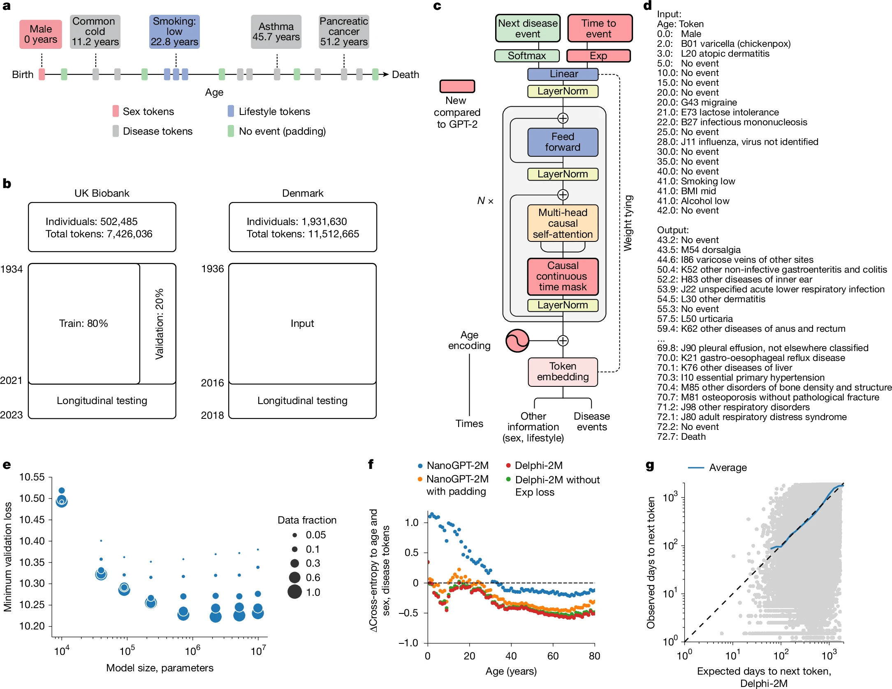
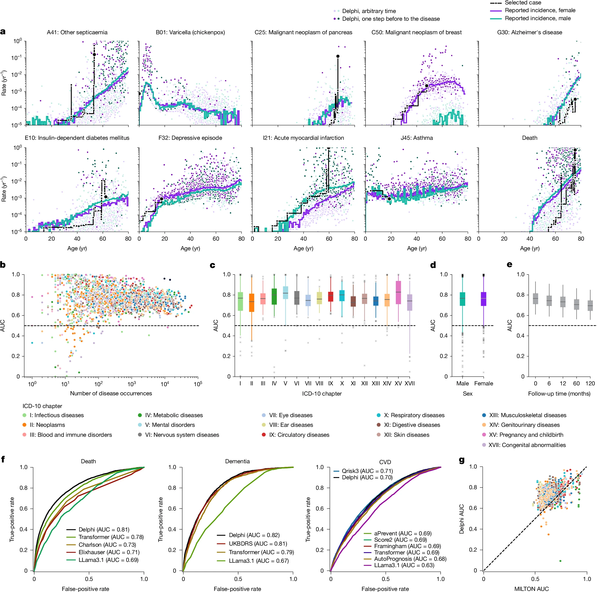
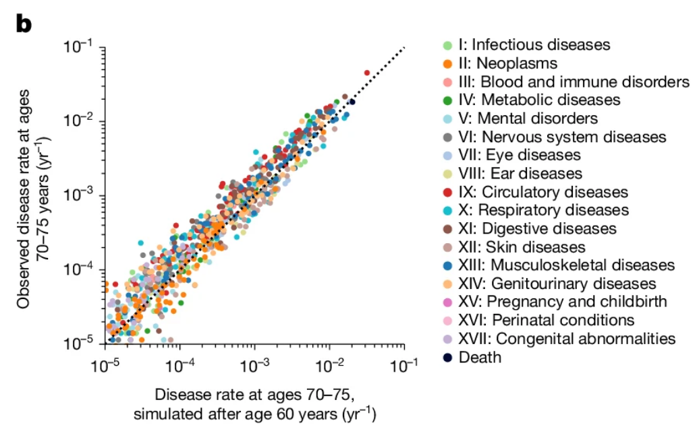
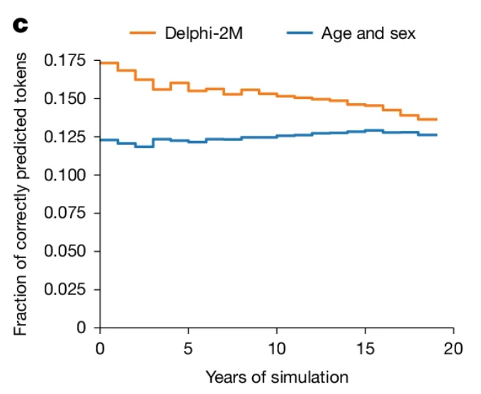
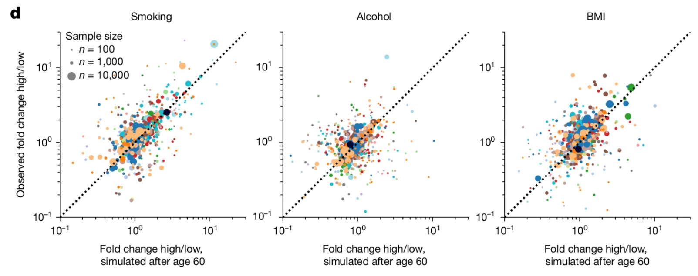

## Limitations in current methods

::: {style="font-size: 75%;"}
-   Diseases and conditions don't happen in <ins> **isolation** </ins> -
    they cluster and affect each other's progression
-   Current risk prediction methods operate in silos, concentrating on
    <ins> **one condition** </ins> at a time
-   In most patients with intensive health burden, for e.g. aging
    populations, better models are required to represent the complexity
    of multiple diseases and their progression
:::

------------------------------------------------------------------------

## Mapping human history as a large language model (LLM)

::: {style="font-size: 75%;"}
-   LLMs, like ChatGPT and Claude, use statistical models to predict the
    next word in a sentence based on the previous words
-   The paper hypothesizes that a similar approach can be applied to
    disease progression, where past diagnoses can be used to predict
    future ones
-   Diseases are "words," a patient's health history is a "sentence"
:::

------------------------------------------------------------------------

::: {style="font-size: 85%;"}
#### Delphi, a modified GPT architecture, models health trajectories

{.lightbox .r-stretch group="my-gallery"
width="75%" fig-align="bottom"}
:::

:::: {.fragment style="display:none"}
::: {style="font-size: 85%;"}
{.lightbox group="my-gallery"}

{.lightbox group="my-gallery"}

{.lightbox
group="my-gallery"}

{.lightbox group="my-gallery"}

{.lightbox group="my-gallery"}

{.lightbox group="my-gallery"}

{.lightbox
group="my-gallery"}
:::
::::

------------------------------------------------------------------------

## GPT-2 vs Delphi-2M

::: {style="font-size: 75%;"}
| GPT-2 (Original) | Delphi-2M (Modified) |
|------------------------------------|------------------------------------|
| Discrete positional encoding | **Continuous age encoding** (sine/cosine) |
| Predicts next token only | **Also predicts time to next event** (exponential model) |
| Standard causal masking | **Masks same-time tokens** (no circular causality) |

-   Model size: 2.2 million parameters (12 layers, 12 heads, 120-dim
    embedding)

-   Follows empirical scaling laws — performance improves with more data
:::

------------------------------------------------------------------------

::: {style="font-size: 85%;"}
#### Results

{.lightbox .r-stretch width="60%" fig-align="bottom" group="my-gallery2"}
:::

:::: {.fragment style="display:none"}
::: {style="font-size: 85%;"}
{.lightbox group="my-gallery2"}

{.lightbox group="my-gallery2"}

{.lightbox
group="my-gallery2"}
:::
::::

---

## Results and Discussion

::: {style="font-size: 75%;"}
-   Performed significantly well across **\~1,000 diseases**

-   Average AUC **\~0.76** across all diseases in internal validation

-   **97%** of diagnoses had AUC \> 0.5 (better than random)

-   Predicting death: AUC = **0.97**

-   Performance holds up to 10 years into the future (AUC **\~0.70**)

Compared to current standards:

- Matches or beats cardiovascular risk scores (Framingham, QRisk3)

- Matches dementia risk scores (UKBDRS)

- Outperforms death prediction tools (Charlson, Elixhauser)
:::

------------------------------------------------------------------------

## Results and Discussion

::: {style="font-size: 75%;"}

- For a patient with digestive tract diseases → pancreatic cancer risk elevated **19×**

- Pancreatic cancer diagnosis → mortality rate elevated **\~93,000×**

- Chickenpox peaks in childhood; heart attacks rise exponentially with age 

- Delphi updates each person's risk every time a new diagnosis is recorded
:::

------------------------------------------------------------------------

## Clinical and Biological Revalence

::: {style="font-size: 75%;"}

- Unlike conventional models, Delphi can sample entire future health trajectories

- **Input**: everything known about a patient up to age 60 

- **Output**: simulated health events for the next 20 years 

- **Applications**: 
    - Estimating future disease burden at population scale 
    - Planning healthcare resources for specific communities 
    - Identifying who needs screening before conventional age thresholds

:::

---

::: {style="font-size: 85%;"}
#### Clinical and Biological Revalence

{.lightbox .r-stretch width="100%" fig-align="bottom" group="my-gallery3"}
:::

:::: {.fragment style="display:none"}
::: {style="font-size: 85%;"}
{.lightbox group="my-gallery3"}

{.lightbox group="my-gallery3"}

{.lightbox
group="my-gallery3"}

{.lightbox group="my-gallery3"}

{.lightbox group="my-gallery3"}

:::
::::

------------------------------------------------------------------------

## Clinical and Biological Revalence

::: {style="font-size: 75%;"}

- Early **Cancer** or any disease screenings

- **Clinical Decision Support** by including multi-disease risk

- Predicting **community-level** disease burden for healthcare planning 

- **Digital Twin** technology and **Similar Patient** identification for personalized medicine

:::

------------------------------------------------------------------------

## Limitations

::: {style="font-size: 75%;"}

- Only predicts **correlations, not causations**

- Limited performance for ages 80+ (insufficient training data) 

- Diabetes prediction still outperformed by a **single** blood biomarker (HbA1c)

- UK Biobank population is skewed towards white, affluent, educated — the **healthy volunteer** bias 

- Recruitment ages are between 40-70 years old and hence underestimates early mortality (**immortality bias**)

- Data source missingness (hospital vs. GP records) influences predictions

:::

---

## Future Directions 

::: {style="font-size: 75%;"}

- Add genomic data, imaging, wearables, prescription records 
- Connect Delphi to LLMs as a risk module
- Integration of free-text clinical notes

If interested, you can also read Dr. [Yonghui Wu's](https://hobi.med.ufl.edu/profile/wu-yonghui/) thoughts on the paper in [Nature](https://www.nature.com/articles/d41586-025-02971-3.epdf?sharing_token=6bZNwgl7p8iMvzaxLNtK2tRgN0jAjWel9jnR3ZoTv0OKcQL6Zag4IX8KUDJuNibaWQhQspiap4-ewfy70yBN47_BUIzU3tsSpJtnMXwhKpCK43-tB41n9zCrWBkeDouQoiaJIAQUXeuCxFKbgNTXw7gGZDXM6KyyaU8E_99PEZM%3D)

:::

--- 

## Information Modelling Context
::: {style="font-size: 65%;"}

- Based on the study, results and limitations presented by the researchers, they use the phrase **AI** very carefully (less than 10 times in the paper text)

- A rational understanding of Delphi will validate the same - there is nothing **artificially intelligent** about it

- It is a **statistical model** that learns patterns in data and makes predictions based on those patterns

- The part that seperates it from other similar studies is their implmentation of disease history modelling as the input for their model, representing events in a time-series, **generalizable** to any patient in any common data model (For e.g. i2b2, OMOP, PCORNET, etc.)

- Fixed coordinate systems are not a new concept- principles of genetic data analysis are build on genomic coordinates that are uniform across all patients, and hence it is easier to identify mutations and changes and make inferences about their effects on disease risk and progression

- Similarly, the use of age as a coordinate system for disease history allows for a more standardized and interpretable representation of health trajectories, which can be applied across different patient populations and healthcare settings
:::

---
## Questions? {.center}