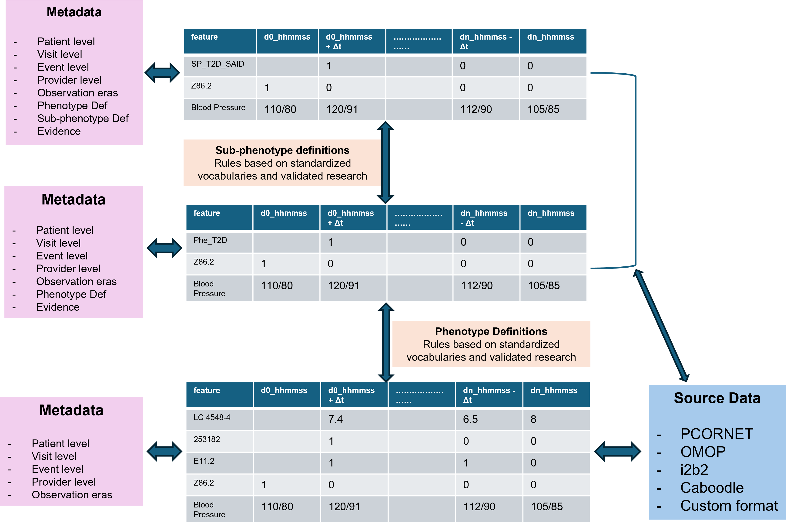
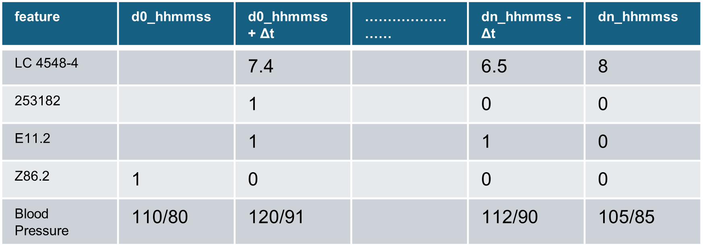
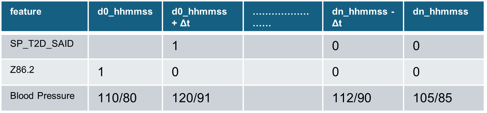

### Introduction 

::: {style="font-size: 80%;"} 

- Electronic Health Records (EHR) contain rich longitudinal patient data but the richness is seldom used
- Traditional ML models flatten time which loses loses sequence information
- Deep Learning promises
    - patient trajectory modeling
    - digital twins
    - similarity-based medicine
- The current bottleneck is the availability of clinical data in an **usable** format
- Current healthcare data systems have the capability of creating a human health map that can propel **precision medicine**

::: 

---

### Limitations with current data models

::: {style="font-size: 80%;"}

- Current Prediction Models are trained on *limited* datasets - the **limited** refers to the scope of information contained in them
- For example, [OMOP](https://ohdsi.github.io/CommonDataModel/index.html), the most popular open-source common data model, doesn't have a way to separate **telephone** and **telehealth** interactions with the health system 
- Reasons
    - HIPAA and Privacy Data Sharing Restrictions
    - Common Data Models have *common* representations but *variable* transformation workflows
    - *Intensive*, but *not interoperable* resource investment
- A current limitation is the variability of patient histories across different time scales and clinical contexts, which adds friction for the process of direct comparison

:::

---

### How do we solve this?   

::: {style="font-size: 80%;"}

- Genomic data is already structured as a fixed coordinate index on genomes
- For e.g. Mutation at chromosome *a*, postion *b* means the same for **everyone**
- This helps direct comparision across individuals and ML at scale
- Mathematically, each genome is represented as a vector in shared space

$g \in$ {$A,C,G,T$}$^n$

- Genomic data, however, doesn't support trajectories, since it is mostly static

:::

---

### The Fixed Coordinate Temporal Data Model

::: {style="font-size: 80%;"}

- A fixed coordinate system for EHR representation can align patient trajectories for mapping clinically relevant data in a deterministic manner
- The fixed coordinate tensor takes inspiration from genomic data representation
- Each patient will be represented as a point in a shared coordinate space

$Health Coordinate = z(t) \in R^d$

where **$z$** are the physiological coordinates, **$t$** is time since birth and **$R^d$** represents d-Dimension real space

- The health history of each patients becomes a **sequence** from birth -> present -> future

:::

---

::: {style="font-size: 80%;"}

### The Fixed Coordinate Temporal Data Model

{.lightbox .r-stretch width="70%" fig-align="bottom" group="my-gallery2"}

:::

:::: {.fragment style="display:none"}
::: {style="font-size: 85%;"}

{.lightbox group="my-gallery2" fig-alt="Fixed Coordinate Temporal Data Model - Base Layer"}

{.lightbox group="my-gallery2" fig-alt="Fixed Coordinate Temporal Data Model - Example Phenotype Layer"}

{.lightbox group="my-gallery2" fig-alt="ixed Coordinate Temporal Data Model - Example Subphenotype Layer"}

{.lightbox group="my-gallery2" fig-alt="Fixed Coordinate Temporal Data Model - Splicing Example"}

:::
::::
---

### Dataset

::: {style="font-size: 80%;"}

- Fully deidentified [OMOP Dataset](https://idr.ufhealth.org/research-services/omop/covid-19-patient-dataset/) from UF Health IDR for COVID patients

- The dataset consists of COVID-19 positive patients in UF Health EHR, and their records transformed into OMOP Common Data Model

- Date Range : 2020 - current

- The following OMOP CDM tables will be primarily used-

    -   person
    -   condition_occurrence
    -   drug_exposure
    -   measurement
    -   procedure_occurrence
    -   visit_occurrence

:::

---

### Dataset

::: {style="font-size: 80%;"}

- Input
  - Condition
  - Drug
  - Procedure
  - Measurement
  - Visit
  - Time-ordered events

- Index Event
  First diagnosis of COVID-19
  
- Output
  Adverse event within 6 month post index

:::

---

### Key Design Decisions

::: {style="font-size: 80%;"}

**Temporal Split**
  - Data before the index date are treated as features
  
  - Date after the index date are treated as labels
  
  - Prevents leakage
  
  - *Challenging since data was 2020 onwards*
  
**Cohort Balance**
  - Balanced case-control in training

**Sub-Sample: 500 patients**
  - Due to resource intensiveness, the project was done on a proof-of-concept scale
  
  - Controlled computational complexity reduced

**Time Binning**
  - Discrete event sequences for stability

:::

---

### Experimental Setup

::: {style="font-size: 80%;"}

- **Models evaluated**
    - Logistic Regression
    - Random Forest
    - XGBoost
    - Gated Recurrent Unit (FCT model)

- **Metrics**
    - AUC-ROC
    - Classification accuracy
    - Embedding-based similarity

:::

---

### Results

::: {style="font-size: 80%;"}

| Finding Category |        Key Results      |
|-----------------|-------------|
| **XGBoost** | 0.96 
| **Random Forest** | 0.95
| **GRU** | 0.50

:::

---

### Key Observations

**Why GRU underperformed**

::: {style="font-size: 80%;"}

- Sparse clinical sequences

- Short observation windows (COVID cohort)

- Weak temporal signal in dataset

- Dominance of static patient features

:::

**Why tree models performed well**

::: {style="font-size: 80%;"}

- Strong signal in:
    - comorbidities
    
    - baseline conditions
    
    - aggregated clinical history

:::

---

::: {style="font-size: 80%;"}

*In this dataset, patient outcome is primarily determined by static clinical state, not temporal evolution*

- Implication:
    - sequence modeling adds little value
    - feature aggregation captures most signal

:::

---

### Strength of Feature-Based Models in this case

::: {style="font-size: 80%;"}

- **Advantages**
    - Robust to sparsity
    - Works well with small datasets
    - Handles categorical + count-based features naturally
    - Less sensitive to missing temporal structure

- **Result**

    - higher performance
    - more stable
    - easier to interpret

:::

---

### FCT-Tensor Model : Strengths

::: {style="font-size: 80%;"}

Even though it under performed here, it provides the following capabilites

  - Patient trajectory embedding
  - Sequence similarity (phenotyping)
  - Potential for digital twins
  - Captures temporal dependencies (when present)

:::

---

### FCT-Tensor Model : Limitations

::: {style="font-size: 80%;"}

- Requires large longitudinal datasets
- Sensitive to padding and sparsity
- Needs dense event history
- Hard to train on small cohorts (like 500 patients)
- Weak signal if outcomes are static-risk driven

:::

---

### FCT-Tensor Model : Applications

::: {style="font-size: 80%;"}

- **Patient Similarity** : find clinically similar trajectories

- **Disease Progession Modeling** for chronic diseases

- **Digital Twin Simulation** to observation invention effects

- **Early Warning System**: For e.g. deterioration in ICU

:::

---

### FCT-Tensor Model : Future Improvements

::: {style="font-size: 80%;"}

- Data improvements:
    - larger longitudinal cohorts
    
    - pre-COVID + post-COVID history
    
    - richer event sequences
    
    - **For the report** : try to use a different, more expansive OMOP dataset to compare sequence and feature based models
    

- Model improvements:
    
    - attention mechanisms
    
    - transformer-based EHR models
    
    - event-type embeddings (drug/condition separation)
    
    - time-gap encoding
    

:::

---

### Conclusions

::: {style="font-size: 80%;"}

  - Feature-based models (XGBoost) outperform sequence models in this dataset
  
  - GRU underperformance is due to data structure, not model failure
  
  - Temporal modeling is valuable only when:
    - long longitudinal history exists
    
    - rich event sequences are available
	
:::

---

## Questions?  {.center}

---

## Thank you  {.center}

::: {style="font-size: 65%;"}

This presentation was made using Quarto. Quarto enables you to weave together content and executable code into a finished document. [Click here](https://quarto.org) learn more about Quarto.
:::

