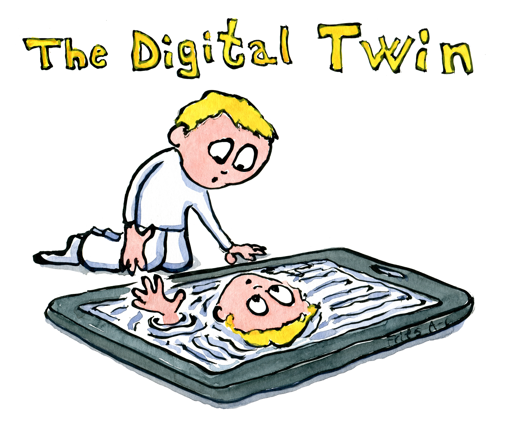
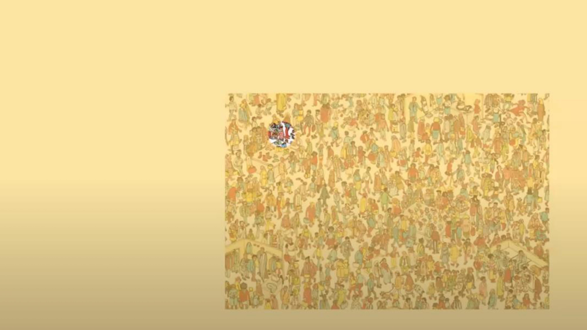
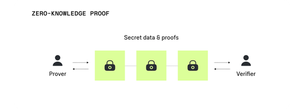
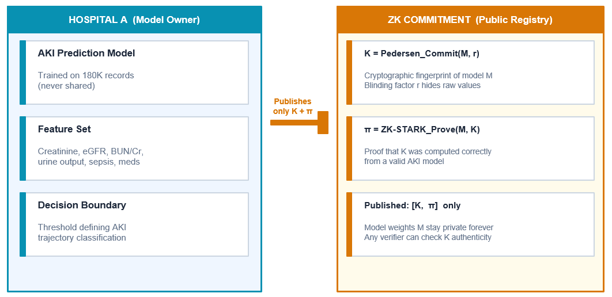
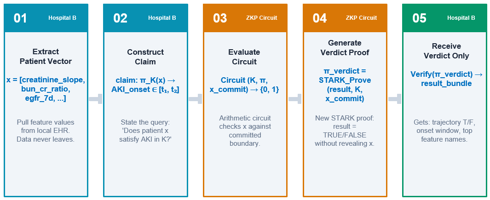
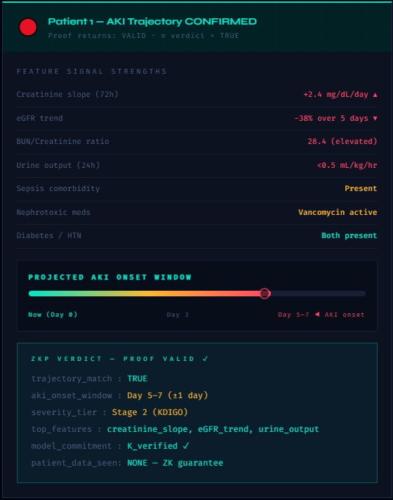
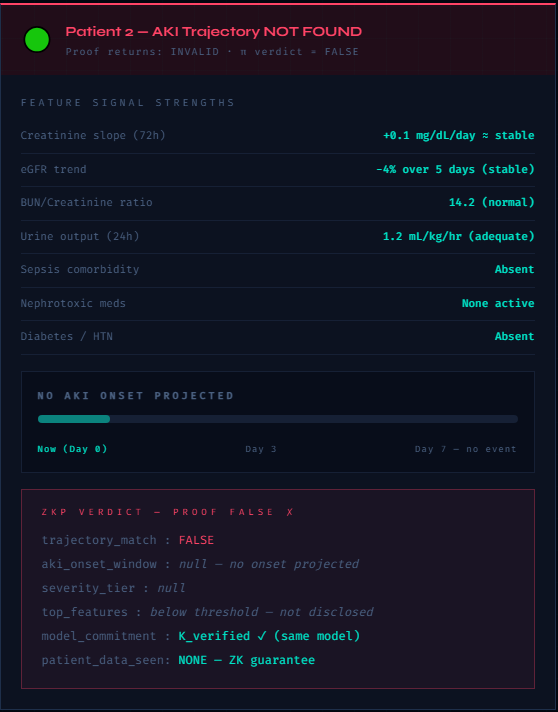

### Rich Data Poor Data 

<!-- ::: {style="font-size: 80%;"} -->

- Data, especially **healthcare data** is touted as the *new currency*
<!--- Current healthcare data systems have the capability of creating a human health map that can propel *precision medicine* -->
- The issue with our new currency is that while it is easy to *deposit* in a bank, there is **little** to **no** yield on it 
- Clinical Informatics Decision Making is built on averages, and you can read the book [Flaw of Averages](https://www.oreilly.com/library/view/the-flaw-of/9780470488126/sava_9780470488126_oeb_c01_r1.html) to see why it is generally not a good idea
<!-- ::: -->

<!-- ::: -->

---

### Knowledge - Mile Wide and Inch Deep 

<!-- ::: {style="font-size: 80%;"} -->

- Current Prediction Models are trained on *limited* datasets - the **limited** refers to the scope of information contained in them
<!--- For example, [OMOP](https://ohdsi.github.io/CommonDataModel/index.html), the most popular open-source common data model, doesn't have a way to separate **telephone** and **telehealth** interactions with the health system -->
- Reasons
    - HIPAA and Privacy Data Sharing Restrictions
    - Even when shared, data is *paranormally distributed*
    - Common Data Models have *common* representations but *variable* transformation workflows
    - *Intensive*, but *not interoperable* resource investment
<!-- ::: -->

---

### The Fix  

<!-- ::: {style="font-size: 80%;"} -->

- Genomic data is already structured as a fixed coordinate index on genomes
- For e.g. Mutation at chromosome *a*, postion *b* means the same for **everyone**
- This helps direct comparision across individuals and ML at scale
- Mathematically, each genome is represented as a vector in shared space

$g \in$ {$A,C,G,T$}$^n$

- Genomic data, however, doesn't support trajectories, since it is mostly static

---

### The Fixed Coordinate Temporal Data Model
- We will look at genomic data structure for **inspiration**, not **instruction**
- Each patient will be represented as a point in a shared coordinate space

$Health Coordinate = z(t) \in R^d$

where **$z$** are the physiological coordinates, **$t$** is time since birth and **$R^d$** represents d-Dimension real space

- The health history of each patients becomes a **sequence** from birth -> present -> future

<!-- ::: -->

---

::: {style="font-size: 100%;"}

### The Fixed Coordinate Temporal Data Model

{.lightbox .r-stretch width="70%" fig-align="bottom" group="my-gallery2"}

:::

:::: {.fragment style="display:none"}
::: {style="font-size: 85%;"}

{.lightbox group="my-gallery2" fig-alt="Fixed Coordinate Temporal Data Model - Base Layer"}

{.lightbox group="my-gallery2" fig-alt="Fixed Coordinate Temporal Data Model - Example Phenotype Layer"}

{.lightbox group="my-gallery2" fig-alt="ixed Coordinate Temporal Data Model - Example Subphenotype Layer"}

{.lightbox group="my-gallery2" fig-alt="Fixed Coordinate Temporal Data Model - Splicing Example"}

:::
::::
---

#### Applications - Similar Patients

:::: columns
::: {.center}
::: {.column width="50%"}
::: {style="font-size: 85%;"}
- To identify patients with similar physiology in this shared coordinate space, mathematically, we can calculate distance $d$ and specify threshold $\epsilon$

$d = ||z$~$1$~$(t) - z$~$2$~$(t)|| < \epsilon$

- Imagine if clinicians can readily review - **what happened to the patients most like my patient?**

:::
:::
::: {.column width="50%"}
::: {style="font-size: 80%;"}
{.r-stretch width="80%" fig-alt="3 Spiderman from Marvel Movies, representing Similar Patients Matching"}
:::
:::
:::
::::

---

#### Applications - Digital Twin

:::: columns
::: {.center}

::: {.column width="45%"}
::: {style="font-size: 80%;"}
{.r-stretch width="100%" fig-alt="A chid looking into their device to see a mirror image of them, representing Digital Twin"}
:::
:::

::: {.column width="47%"}
::: {style="font-size: 85%;"}
- As patients move through the shared coordiante space over time, it can mathematically represented as

$z(t) = z(t + \Delta t)$

- This can help simulate the odds of
    - Progression of disease
    - Response to treatments and adverse events
    - Risk of complications

:::
:::

:::
::::

---

### What about Privacy?  

- Genomic data, for all its benefits, cannot be *deidentified* or *privacy-protected* without **losing significant information**

- Our proposed method while making *representation* and *analysis* easier, makes **deidentification** exponentially tougher

- HIPAA and Privacy doesn't allow hospitals to share patient data in raw or even transformed format

- Data is touted as the *new currency*, but the most important universal currency is **trust**
---

::: {style="font-size: 100%;"}

### Zero-Knowledge Proofs (ZKP)

{.lightbox .r-stretch width="70%" fig-align="bottom" group="my-gallery2" fig-alt="Where is Wally?"}

:::

:::: {.fragment style="display:none"}
::: {style="font-size: 85%;"}

{.lightbox group="my-gallery2" fig-alt="Here is Wally"}

:::
::::

---

### ZKP with Fixed Coordinate Temporal Data

- Our proposed fixed coordinate sequence can easily be *matched* because as the length of the sequence increases, the odds of another sequence with ~100% similarity decreases
- Zero Knowledge Proofs (**ZKP**s) can prove - for a given *input* and *model*, an *output* is produced, without revealing any of the above

---

### Proposed Workflow

- Hospital A has deployed an AKI prediction model that Hospital B wants to use with their patients

- Traditional Requirements
    - Hospital A publishes their model and Hospital B runs it on their patients, OR
    - Hospital B sends deidentifed dataset to Hospital A
    - Requires intensive review from HIPAA, and will most probably not be allowed

---

::: {style="font-size: 100%;"}

### ZKP Workflow

{.lightbox .r-stretch width="100%" fig-align="bottom" group="my-gallery2" fig-alt="General ZKP workflow"}

:::

:::: {.fragment style="display:none"}
::: {style="font-size: 85%;"}

{.lightbox group="my-gallery2" fig-alt="Step 1 - Hospital A publishes one commitment K — a cryptographic fingerprint of its model"}

{.lightbox group="my-gallery2" fig-alt="Hospital B can run that commitment against any of its own patients, any number of times, without Hospital A ever being involved again"}

{.lightbox group="my-gallery2" fig-alt="Example: For Patient 1, the arithmetic circuit finds the feature vector satisfies the AKI decision boundary, hence proof is TRUE, and the onset window is disclosed"}

{.lightbox group="my-gallery2" fig-alt="Example: For Patient 2, the same circuit finds the vector falls outside the boundary, hence proof is FALSE, and nothing further is revealed — not even how far below the threshold the patient is"}

:::
::::

---

### Moving Forward

- **Phase 1** - Draft transformation architecture for fixed coordinate temporal data model to and from common CDM like [i2b2](https://www.i2b2.org), [OMOP](https://ohdsi.github.io/CommonDataModel/index.html), Epic Caboodle. The source code for open-source model will be made available as a open-source resource
- **Phase 2** - Test Phase A on sample AKI patients at UF Health and validate it over larger datasets, like [Epic COSMOS](https://cosmos.epic.com)
- Generate prototype ZK [STARK](https://aszepieniec.github.io/stark-anatomy/) infrastructure using temporal data model for AKI risk prediction, similar patient matching and digital twin trajectory on a small sample of patients

---

### Current Limiting Factors

- Fixed Coordinate Temporal Data Model
    - Requires *clean* source datasets
    - *Variability* in methods is lower but not $0$
- Zero Knowledge Proofs
    - *Expensive* and *slow* for complex models (e.g. Neural Networks), may need quantization
    - *Latency*, especially if needed real-time
    - ZKPs are based on Math Intelligence, so not black boxes, but *interpretation is more difficult* than standard workflows
    - *Model Drift* as data changes

---

### Why Now?

- Verification *resources can be federated* (similar to crypto blockchains) since no sensitive data is required in this step
- On May 31st, UF Health EHR will have 15 years of data in EPIC EHR - Medicine is finally *digital* and *massive* with multi-omics domains
- ZKP will enable ML models to be trained with *larger, more diverse* data points
- ZKP, along with fixed coordinate data model can achieve "actual" *Clinical Decision Support System*
- Instead of **can we afford to do it**, the question should be **can we afford not to do it**?

---

### Why Now?  {.center}

::: {.fragment .fade-in-then-semi-out}

- In [Victor Hugo](https://www.britannica.com/biography/Victor-Hugo)'s words

Nothing is as powerful as 
an idea whose time has come

:::

::: {.fragment .fade-in}

- Also, in Academy Award Winning Artist [Ejae](https://open.spotify.com/artist/0RMJOzHDhAKY1o2j0W0vxY)'s words

<!-- I'm done hidin', now I'm shinin' like I'm born to be
We dreamin' hard, we came so far, now I believe -->
We're goin' up, up, up, it's our moment

You know together we're glowin'

Gonna be, gonna be golden

:::
---

## Thank you  {.center}

::: {style="font-size: 65%;"}

This presentation was made using Quarto. Quarto enables you to weave together content and executable code into a finished document. [Click here](https://quarto.org) learn more about Quarto.
:::
